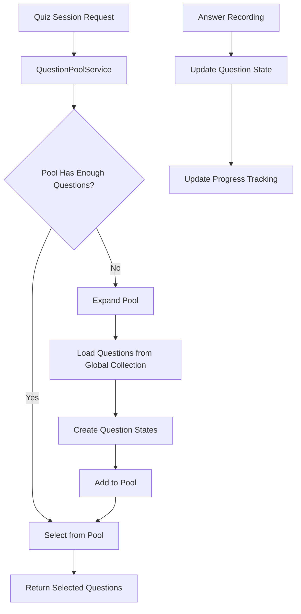

# Design Document

## Overview

The question pool architecture redesigns the question loading system from a lazy loading approach to a proactive pool-based system. Instead of loading all questions and then filtering by existing states, the new system maintains a user-specific pool of question states that includes both seen and unseen questions. This enables more efficient querying, better randomization, and improved performance.

The key innovation is that question states are created before questions are shown to users, allowing for sophisticated filtering and selection algorithms while maintaining excellent query performance.

## Architecture

### Current Architecture Problems

The existing system has several limitations:

1. **Inefficient Querying**: Must load all questions for a category, then load all question states, then filter in memory
2. **Poor Randomization**: Questions are selected from whatever happens to be available after filtering
3. **Scalability Issues**: Performance degrades as the number of questions and users grows
4. **Limited Filtering**: Cannot efficiently filter by difficulty or other criteria combined with user progress

### New Pool-Based Architecture

The new architecture introduces a "question pool" concept where:

1. **Question Pool**: Each user has a pool of question states that represents their personalized question deck
2. **Proactive State Creation**: Question states are created when questions are added to the pool, not when first seen
3. **Efficient Querying**: Direct queries on question states with proper indexes
4. **Dynamic Pool Growth**: Pool expands automatically when more questions are needed

### System Components



## Components and Interfaces

### QuestionPoolService

The core service responsible for managing user question pools:

```dart
class QuestionPoolService {
  Future<List<Question>> getQuestionsForSession({
    required String userId,
    required int count,
    String? categoryId,
    String? difficulty,
  });
  
  Future<void> expandPool({
    required String userId,
    String? categoryId,
    String? difficulty,
    int batchSize = 200,
  });
  
  Future<void> recordAnswer({
    required String userId,
    required String questionId,
    required bool isCorrect,
  });
  
  Future<PoolStatistics> getPoolStatistics(String userId);
}
```

### Enhanced QuestionState Model

Extended to support the pool architecture:

```dart
class QuestionState {
  final String questionId;
  final int seenCount;
  final int correctCount;
  final bool mastered;
  final DateTime? lastSeenAt;
  
  // New fields for pool architecture
  final String? categoryId;        // Denormalized for efficient filtering
  final String? difficulty;       // Denormalized for efficient filtering
  final double? randomSeed;        // For consistent randomization
  final DateTime addedToPoolAt;    // When added to user's pool
  
  // Computed properties
  bool get isUnseen => seenCount == 0;
  bool get isUnmastered => !mastered;
}
```

### PoolExpansionStrategy

Interface for different pool expansion strategies:

```dart
abstract class PoolExpansionStrategy {
  Future<List<String>> selectQuestionsForPool({
    required String userId,
    String? categoryId,
    String? difficulty,
    required int count,
  });
}

class RandomPoolExpansionStrategy implements PoolExpansionStrategy {
  // Implementation for random selection with pagination
}

class DifficultyProgressiveStrategy implements PoolExpansionStrategy {
  // Implementation for progressive difficulty
}
```

## Data Models

### Enhanced Question Collection

The global questions collection gains additional fields for pool management:

```dart
// questions/{questionId}
{
  'categoryId': String,
  'text': String,
  'options': List<String>,
  'correctIndices': List<int>,
  'explanation': String,
  'tips': String?,
  'sourceLabel': String?,
  'sourceUrl': String?,
  'difficulty': String,           // Changed from int to string for better filtering
  'isActive': bool,
  'createdAt': Timestamp,
  'sequence': int,                // NEW: Monotonically increasing global index (1, 2, 3, ...)
  'randomSeed': double,           // Random value 0-1 for randomization within pool
}
```

### Enhanced QuestionState Collection

The user's question states collection is enhanced to support pool operations:

```dart
// users/{userId}/questionStates/{questionId}
{
  'questionId': String,
  'seenCount': int,
  'correctCount': int,
  'lastSeenAt': Timestamp?,
  'mastered': bool,
  
  // New pool-specific fields
  'categoryId': String,           // Denormalized from question
  'difficulty': String,           // Denormalized from question
  'randomSeed': double,           // Denormalized from question (for pool randomization)
  'sequence': int,                // Denormalized from question (for tracking)
  'addedToPoolAt': Timestamp,     // When added to user's pool
  'poolBatch': int,               // Which expansion batch this came from
}
```

### Pool Metadata (Optional)

Optional collection for tracking pool statistics:

```dart
// users/{userId}/poolMetadata/stats
{
  'totalPoolSize': int,
  'unseenCount': int,
  'unmasteredCount': int,
  'masteredCount': int,
  'lastExpansionAt': Timestamp,
  'expansionBatchCount': int,
  'maxSequenceInPool': int,       // Single global max sequence
  'categoryCounts': Map<String, int>,
}
```

## Question Selection Algorithm

### Three-Tier Priority System

1. **Tier 1: Unseen Questions** (`seenCount == 0`)
   - Highest priority
   - Random selection within tier
   - Ensures users see new content first

2. **Tier 2: Unmastered Questions** (`seenCount > 0 && mastered == false`)
   - Medium priority
   - Sorted by `lastSeenAt` (oldest first) then randomized
   - Ensures review of struggling content

3. **Tier 3: Mastered Questions** (`mastered == true`)
   - Lowest priority
   - Random selection for maintenance review
   - Only used when tiers 1 and 2 are exhausted

### Selection Flow

```dart
Future<List<Question>> getQuestionsForSession({
  required String userId,
  required int count,
  String? categoryId,
  String? difficulty,
}) async {
  // Step 1: Query existing pool
  final poolQuestions = await _queryPool(userId, categoryId, difficulty);
  
  // Step 2: Separate by priority tiers
  final unseen = poolQuestions.where((q) => q.isUnseen).toList();
  final unmastered = poolQuestions.where((q) => q.isUnmastered).toList();
  final mastered = poolQuestions.where((q) => q.mastered).toList();
  
  // Step 3: Select from tiers in priority order
  final selected = <QuestionState>[];
  
  // Tier 1: Unseen (random)
  if (unseen.isNotEmpty) {
    unseen.shuffle();
    selected.addAll(unseen.take(count - selected.length));
  }
  
  // Tier 2: Unmastered (oldest first, then random)
  if (selected.length < count && unmastered.isNotEmpty) {
    unmastered.sort((a, b) => a.lastSeenAt?.compareTo(b.lastSeenAt ?? DateTime.now()) ?? 0);
    final oldestUnmastered = unmastered.take(count * 2).toList();
    oldestUnmastered.shuffle();
    selected.addAll(oldestUnmastered.take(count - selected.length));
  }
  
  // Tier 3: Mastered (random)
  if (selected.length < count && mastered.isNotEmpty) {
    mastered.shuffle();
    selected.addAll(mastered.take(count - selected.length));
  }
  
  // Step 4: Expand pool if needed
  if (selected.length < count) {
    await expandPool(userId: userId, categoryId: categoryId, difficulty: difficulty);
    // Retry selection with expanded pool
    return getQuestionsForSession(userId: userId, count: count, categoryId: categoryId, difficulty: difficulty);
  }
  
  // Step 5: Load actual question documents
  return await _loadQuestionDocuments(selected.map((s) => s.questionId).toList());
}
```

## Pool Expansion Strategy

### Batch-Based Expansion

Pool expansion occurs in configurable batches (default: 200 questions) using simple sequence-based pagination:

```dart
Future<void> expandPool({
  required String userId,
  String? categoryId,
  String? difficulty,
  int batchSize = 200,
  int maxBatches = 3,
}) async {
  // Load pool metadata to get last sequence
  final poolMeta = await _loadPoolMetadata(userId);
  final lastSequence = poolMeta?.maxSequenceInPool ?? 0;
  
  for (int batch = 0; batch < maxBatches; batch++) {
    // Load next batch of questions from global collection (no category filter during expansion)
    final candidates = await _loadCandidateQuestions(
      batchSize: batchSize,
      afterSequence: lastSequence + (batch * batchSize),
    );
    
    if (candidates.isEmpty) break;
    
    // Filter candidates by category/difficulty if needed and check existing states
    final filteredCandidates = candidates.where((q) {
      if (categoryId != null && q.categoryId != categoryId) return false;
      if (difficulty != null && q.difficulty != difficulty) return false;
      return true;
    }).toList();
    
    // Check which candidates are already in pool
    final existingStates = await _loadExistingStates(userId, filteredCandidates.map((q) => q.id).toList());
    
    // Create states for new questions
    final newStates = <QuestionState>[];
    for (final question in filteredCandidates) {
      if (!existingStates.containsKey(question.id)) {
        newStates.add(QuestionState.createForPool(
          questionId: question.id,
          categoryId: question.categoryId,
          difficulty: question.difficulty,
          randomSeed: question.randomSeed,
          sequence: question.sequence,
          poolBatch: batch,
        ));
      }
    }
    
    // Batch write new states and update pool metadata
    if (newStates.isNotEmpty) {
      await _batchCreateStatesAndUpdateMetadata(userId, newStates);
    }
    
    // Check if we have enough unseen questions now for the requested filters
    final unseenCount = await _countUnseenInPool(userId, categoryId, difficulty);
    if (unseenCount >= 10) break; // We have enough questions for a quiz session
    
    // If this batch didn't give us enough questions, continue to next batch
    // This handles the rare case where a batch has few questions of the desired category
  }
}
```

### Candidate Question Loading

Questions are loaded from the global collection using simple sequence-based pagination:

```dart
Future<List<Question>> _loadCandidateQuestions({
  required int batchSize,
  required int afterSequence,
}) async {
  // Load questions without category/difficulty filters during expansion
  // We'll filter after loading to handle the mixed-category scenario
  final query = _firestore.collection('questions')
      .where('isActive', isEqualTo: true)
      .where('sequence', isGreaterThan: afterSequence)
      .orderBy('sequence')
      .limit(batchSize);
  
  final snapshot = await query.get();
  return snapshot.docs.map((doc) => Question.fromMap(doc.data(), doc.id)).toList();
}

Future<void> _batchCreateStatesAndUpdateMetadata(
  String userId,
  List<QuestionState> newStates,
) async {
  final batch = _firestore.batch();
  
  // Add all new question states
  for (final state in newStates) {
    final stateRef = _firestore
        .collection('users')
        .doc(userId)
        .collection('questionStates')
        .doc(state.questionId);
    batch.set(stateRef, state.toMap());
  }
  
  // Update pool metadata with new maxSequenceInPool
  final maxSequence = newStates.map((s) => s.sequence).reduce((a, b) => a > b ? a : b);
  final metaRef = _firestore
      .collection('users')
      .doc(userId)
      .collection('poolMetadata')
      .doc('stats');
  
  batch.set(metaRef, {
    'maxSequenceInPool': maxSequence,
    'totalPoolSize': FieldValue.increment(newStates.length),
    'unseenCount': FieldValue.increment(newStates.length),
    'lastExpansionAt': FieldValue.serverTimestamp(),
  }, SetOptions(merge: true));
  
  await batch.commit();
}
```

**Key Benefits of Simplified Approach:**

1. **Single Global Counter**: Only track `maxSequenceInPool` - much simpler
2. **Load Then Filter**: Load 200 questions, then filter by category/difficulty in memory
3. **Retry Logic**: If a batch doesn't have enough questions of desired category, try next batch
4. **Handles Edge Cases**: Rare cases where categories are sparse are handled by continuing to next batch
5. **Simple Logic**: Easy to understand and maintain

## Error Handling

### Graceful Degradation

The system handles various error scenarios gracefully:

1. **Network Failures**: Use cached pool data when available
2. **Partial Pool Expansion**: Continue with available questions if some batches fail
3. **Empty Global Collection**: Return empty list with appropriate messaging
4. **Concurrent Updates**: Use Firestore transactions for state updates

### Error Recovery Strategies

```dart
class PoolErrorHandler {
  static Future<List<Question>> handlePoolExpansionFailure({
    required String userId,
    required Exception error,
    required int requestedCount,
  }) async {
    // Log error for monitoring
    _logError('Pool expansion failed', error);
    
    // Try to fulfill request with existing pool
    final existingQuestions = await _getFromExistingPool(userId, requestedCount);
    
    if (existingQuestions.isNotEmpty) {
      return existingQuestions;
    }
    
    // Last resort: return empty list with user-friendly error
    throw QuizException('Unable to load questions. Please check your connection and try again.');
  }
}
```

## Testing Strategy

### Unit Testing

Unit tests will cover individual components and methods:

- `QuestionPoolService` methods with mocked Firestore
- Question selection algorithm with various pool states
- Pool expansion logic with different scenarios
- Error handling and edge cases

### Property-Based Testing

Property-based tests will verify system-wide correctness properties using the `test` package with custom generators.

*A property is a characteristic or behavior that should hold true across all valid executions of a system—essentially, a formal statement about what the system should do. Properties serve as the bridge between human-readable specifications and machine-verifiable correctness guarantees.*

<function_calls>
<invoke name="prework">
<parameter name="featureName">question-pool-architecture


## Correctness Properties

*A property is a characteristic or behavior that should hold true across all valid executions of a system—essentially, a formal statement about what the system should do. Properties serve as the bridge between human-readable specifications and machine-verifiable correctness guarantees.*

### Property Reflection

After analyzing all acceptance criteria, I've identified the following testable properties. Some properties were consolidated to avoid redundancy:

- Properties 1.1 and 1.2 are combined into Property 1 (Priority-based selection)
- Properties 3.1, 3.2, and 3.3 are combined into Property 5 (Answer recording updates)
- Properties 2.3, 2.4, and 2.5 are combined into Property 2 (Pool expansion correctness)

### Property 1: Priority-based question selection

*For any* user pool containing a mix of unseen, unmastered, and mastered questions, when requesting N questions, the system should return unseen questions first, then unmastered questions, then mastered questions, respecting the three-tier priority system.

**Validates: Requirements 1.1, 1.2**

### Property 2: Pool expansion correctness

*For any* pool expansion operation with specified filters (category, difficulty), all newly added question states should have seenCount = 0, match the specified filters, and only include active questions from the global collection.

**Validates: Requirements 2.3, 2.4, 2.5**

### Property 3: Difficulty filtering consistency

*For any* question selection request with a difficulty filter, all returned questions should match the specified difficulty level.

**Validates: Requirements 1.3**

### Property 4: Count constraint satisfaction

*For any* question selection request for N questions from a pool of M questions, the system should return min(N, M) questions.

**Validates: Requirements 1.4**

### Property 5: Answer recording updates all fields

*For any* answer recording operation, the question state should have seenCount incremented by 1, correctCount incremented if correct, and lastSeenAt updated to a recent timestamp.

**Validates: Requirements 3.1, 3.2, 3.3**

### Property 6: Mastery threshold enforcement

*For any* question state where correctCount reaches the mastery threshold (3), the mastered field should be set to true.

**Validates: Requirements 3.4**

### Property 7: No duplicate states in pool

*For any* pool expansion operation performed multiple times, no duplicate question states should exist in the user's pool (each questionId appears at most once).

**Validates: Requirements 4.1**

### Property 8: Partial failure consistency

*For any* pool expansion that fails partially, all existing question states should remain unchanged with their original values.

**Validates: Requirements 4.3**

### Property 9: Required fields completeness

*For any* newly created question state, all required fields (seenCount, correctCount, mastered, lastSeenAt, categoryId, difficulty) should be present with valid initial values.

**Validates: Requirements 4.4**

### Property 10: Error recovery with available questions

*For any* pool operation that encounters errors, the system should continue and return whatever questions are available rather than failing completely.

**Validates: Requirements 4.5**

### Property 11: Mastered fallback behavior

*For any* pool where all questions are mastered, requesting questions should still return questions (from the mastered set) rather than returning empty.

**Validates: Requirements 5.1**

### Property 12: Empty pool triggers expansion

*For any* user with an empty question pool, requesting questions should automatically trigger pool expansion before returning results.

**Validates: Requirements 5.4**

### Property 13: Batch failure recovery

*For any* batch loading operation that fails, the system should either retry with a smaller batch or continue with questions from successful batches.

**Validates: Requirements 5.5**

### Property 14: Filtering by mastery and difficulty

*For any* pool query with mastery status and difficulty filters, all returned question states should match both filter criteria.

**Validates: Requirements 6.4**

## Firestore Indexes

The pool architecture requires specific indexes for optimal performance:

### Required Composite Indexes

1. **questionStates collection (per user)**:
   ```
   Collection: users/{userId}/questionStates
   Fields: mastered (Ascending), seenCount (Ascending), randomSeed (Ascending)
   ```

2. **questionStates with category filter**:
   ```
   Collection: users/{userId}/questionStates
   Fields: categoryId (Ascending), mastered (Ascending), seenCount (Ascending)
   ```

3. **questionStates with difficulty filter**:
   ```
   Collection: users/{userId}/questionStates
   Fields: difficulty (Ascending), mastered (Ascending), seenCount (Ascending)
   ```

4. **questionStates with both filters**:
   ```
   Collection: users/{userId}/questionStates
   Fields: categoryId (Ascending), difficulty (Ascending), mastered (Ascending), seenCount (Ascending)
   ```

5. **questions collection for sequence-based expansion**:
   ```
   Collection: questions
   Fields: isActive (Ascending), sequence (Ascending)
   ```

6. **questions with category filter**:
   ```
   Collection: questions
   Fields: categoryId (Ascending), isActive (Ascending), sequence (Ascending)
   ```

7. **questions with difficulty filter**:
   ```
   Collection: questions
   Fields: difficulty (Ascending), isActive (Ascending), sequence (Ascending)
   ```

8. **questions with both filters**:
   ```
   Collection: questions
   Fields: categoryId (Ascending), difficulty (Ascending), isActive (Ascending), sequence (Ascending)
   ```

## Migration Strategy

### Migrating Existing Users

Existing users have question states only for seen questions. Migration strategy:

1. **Lazy Migration**: Don't migrate existing states immediately
2. **On-Demand Pool Creation**: When a user requests questions, check if they have pool metadata
3. **Initial Pool Seeding**: If no pool metadata exists, seed pool with existing states plus new unseen questions
4. **Gradual Expansion**: Pool grows naturally as users continue using the app

### Migration Script

```dart
Future<void> migrateUserToPoolArchitecture(String userId) async {
  // Check if already migrated
  final poolMeta = await _firestore
      .collection('users')
      .doc(userId)
      .collection('poolMetadata')
      .doc('stats')
      .get();
  
  if (poolMeta.exists) {
    return; // Already migrated
  }
  
  // Get existing question states
  final existingStates = await _firestore
      .collection('users')
      .doc(userId)
      .collection('questionStates')
      .get();
  
  // Add pool-specific fields to existing states
  final batch = _firestore.batch();
  int maxSequence = 0;
  
  for (final doc in existingStates.docs) {
    final questionId = doc.id;
    final question = await _getQuestion(questionId);
    
    if (question != null) {
      batch.update(doc.reference, {
        'categoryId': question.categoryId,
        'difficulty': question.difficulty,
        'randomSeed': question.randomSeed,
        'sequence': question.sequence,
        'addedToPoolAt': FieldValue.serverTimestamp(),
        'poolBatch': 0, // Existing questions are batch 0
      });
      
      if (question.sequence > maxSequence) {
        maxSequence = question.sequence;
      }
    }
  }
  
  // Create pool metadata with single global max sequence
  batch.set(
    _firestore.collection('users').doc(userId).collection('poolMetadata').doc('stats'),
    {
      'totalPoolSize': existingStates.docs.length,
      'maxSequenceInPool': maxSequence,
      'lastExpansionAt': FieldValue.serverTimestamp(),
      'expansionBatchCount': 0,
      'migratedAt': FieldValue.serverTimestamp(),
    },
  );
  
  await batch.commit();
}
```

## Performance Considerations

### Query Optimization

1. **Limit Query Results**: Always use `.limit()` to prevent loading excessive data
2. **Use Composite Indexes**: Ensure all filter combinations have appropriate indexes
3. **Batch Operations**: Use batch writes for creating multiple question states
4. **Pagination**: Use `startAfter` for efficient pagination during pool expansion

### Caching Strategy

1. **Pool Statistics**: Cache pool statistics in memory for the session
2. **Question Documents**: Cache loaded questions to avoid repeated fetches
3. **User Preferences**: Cache difficulty and category preferences

### Monitoring

Track these metrics for performance monitoring:

- Average pool expansion time
- Pool hit rate (questions served from pool vs. requiring expansion)
- Average question selection time
- Pool size distribution across users
- Expansion batch success rate

## Security Rules

Firestore security rules for the pool architecture:

```javascript
rules_version = '2';
service cloud.firestore {
  match /databases/{database}/documents {
    // Question states - users can only access their own
    match /users/{userId}/questionStates/{questionId} {
      allow read, write: if request.auth != null && request.auth.uid == userId;
    }
    
    // Pool metadata - users can only access their own
    match /users/{userId}/poolMetadata/{document=**} {
      allow read, write: if request.auth != null && request.auth.uid == userId;
    }
    
    // Questions - read-only for all authenticated users
    match /questions/{questionId} {
      allow read: if request.auth != null;
      allow write: if false; // Only admins via backend
    }
  }
}
```

## Future Enhancements

### Adaptive Pool Sizing

Adjust pool size based on user behavior:
- Active users: Larger pools (300-500 questions)
- Casual users: Smaller pools (100-200 questions)
- Track pool hit rate and adjust accordingly

### Intelligent Pre-fetching

Pre-fetch questions likely to be needed:
- Predict next category based on user patterns
- Pre-expand pools during idle time
- Background sync for offline support

### Difficulty Progression

Automatically adjust difficulty based on performance:
- Track success rate per difficulty level
- Gradually increase difficulty as user improves
- Provide difficulty recommendations

### Category Balancing

Ensure balanced exposure across categories:
- Track questions answered per category
- Prioritize under-represented categories
- Suggest categories for balanced learning

## Testing Strategy (Continued)

### Unit Testing Framework

Use Dart's `test` package with custom test utilities:

```dart
// Test utilities for pool testing
class PoolTestHelper {
  static Future<void> createTestPool(
    String userId,
    List<QuestionState> states,
  ) async {
    // Helper to create test pools
  }
  
  static Future<void> createTestQuestions(
    List<Question> questions,
  ) async {
    // Helper to create test questions
  }
  
  static void verifyPriorityOrder(
    List<Question> selected,
    List<QuestionState> pool,
  ) {
    // Helper to verify priority ordering
  }
}
```

### Property-Based Testing Configuration

Configure property tests to run sufficient iterations:

```dart
// Each property test should run at least 100 iterations
test('Property 1: Priority-based selection', () async {
  for (int i = 0; i < 100; i++) {
    // Generate random pool state
    final pool = generateRandomPool();
    
    // Test property
    final selected = await service.getQuestionsForSession(
      userId: 'test-user',
      count: 10,
    );
    
    // Verify priority order
    verifyPriorityOrder(selected, pool);
  }
});
```

### Integration Testing

Integration tests will verify end-to-end flows:

- Complete quiz session with pool expansion
- Multiple concurrent users expanding pools
- Migration from old to new architecture
- Error recovery scenarios

### Test Data Generators

Custom generators for property-based testing:

```dart
class QuestionStateGenerator {
  static QuestionState generateUnseen() {
    return QuestionState(
      questionId: generateId(),
      seenCount: 0,
      correctCount: 0,
      mastered: false,
      lastSeenAt: null,
      // ... other fields
    );
  }
  
  static QuestionState generateUnmastered() {
    return QuestionState(
      questionId: generateId(),
      seenCount: random.nextInt(10) + 1,
      correctCount: random.nextInt(3),
      mastered: false,
      lastSeenAt: DateTime.now().subtract(Duration(days: random.nextInt(30))),
      // ... other fields
    );
  }
  
  static QuestionState generateMastered() {
    return QuestionState(
      questionId: generateId(),
      seenCount: random.nextInt(20) + 3,
      correctCount: random.nextInt(10) + 3,
      mastered: true,
      lastSeenAt: DateTime.now().subtract(Duration(days: random.nextInt(30))),
      // ... other fields
    );
  }
}
```

## Implementation Notes

### Backward Compatibility

The new architecture maintains backward compatibility:

1. **Existing QuizService API**: Keep existing method signatures
2. **Gradual Rollout**: Use feature flags to enable pool architecture per user
3. **Fallback Mode**: If pool operations fail, fall back to old algorithm
4. **Data Migration**: Existing question states work with new system

### Rollout Strategy

1. **Phase 1**: Implement pool service alongside existing service
2. **Phase 2**: Enable for internal testing users
3. **Phase 3**: A/B test with 10% of users
4. **Phase 4**: Gradual rollout to 50%, then 100%
5. **Phase 5**: Remove old implementation after validation

### Monitoring and Alerts

Set up monitoring for:

- Pool expansion failures (alert if > 5% failure rate)
- Question selection latency (alert if > 2 seconds p95)
- Pool size anomalies (alert if user pools > 1000 questions)
- Migration failures (alert on any migration errors)

## Summary

The question pool architecture provides a robust, scalable solution for question loading with the following key benefits:

1. **Better Performance**: Direct queries on question states instead of loading all questions
2. **Improved Randomization**: True random selection from properly sized pools
3. **Flexible Filtering**: Efficient filtering by difficulty, category, and mastery status
4. **Scalability**: Grows gracefully as question database and user base expand
5. **User Experience**: Faster question loading and better content distribution

The architecture is designed for gradual adoption with full backward compatibility and comprehensive testing to ensure correctness.